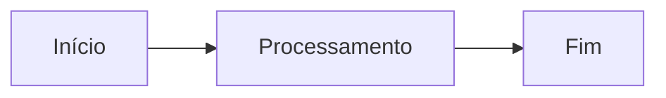

# md2tex

Conversor genérico de documentos **Markdown (`.md`) para LaTeX (`.tex`) e PDF**.

A ferramenta usa o Pandoc para interpretar o Markdown como uma estrutura semântica (AST) e carrega todas as definições de estilo do arquivo de configuração do usuário (`~/.config/md2tex/config.yaml`).

---

## 1. Recursos

- **CLI Instalável**: Comando `md2tex` disponível globalmente ou no ambiente virtual.
- **Configuração do Usuário**: Leitura de pacotes `.sty`, classes de documento e geometrias em `~/.config/md2tex/config.yaml`.
- **Precedência de CLI**: Sobrescrita de configurações via flags CLI (`--config`, `--style`, `--engine`).
- **Saídas Flexíveis**: Geração de código TEX e, opcionalmente, compilação de PDF.
- **Perfis Documentais**: Suporte nativo a relatórios (`report`), memórias de reunião (`meeting-minutes`), ADRs (`adr`) e planos técnicos (`technical-plan`).
- **Estilo Customizado**: Suporte ao carregamento de pacotes `.sty` via arquivo de configuração ou flag CLI.
- **Metadados YAML**: Configuração de capa, título, versão, cliente, data, status e autor via Front Matter ou CLI.
- **Normalização de Títulos**: Remoção automática de numeração manual em títulos Markdown, delegando a numeração ao LaTeX.
- **Formatação Inline Inteligente**:
  - Negrito, itálico, código inline e tachado (inclusive aninhados).
  - Classificação de código: caminhos de arquivos (`\path`), URLs (`\url` com `xurl`), comandos (`\lstinline`) e identificadores (`\texttt`).
- **Controle Avançado de Tabelas**:
  - Envolvimento por ambiente seguro (`\mdtexStartTable` / `\mdtexEndTable`).
  - Orientação automática em paisagem (`auto`, `always`, `never`).
  - Ajuste de fonte (`normalsize`, `small`, `footnotesize`, `scriptsize`) e estratégias de largura (`auto`, `equal`, `natural`).
- **Imagens e Mídia**: Limitação à largura e altura úteis da página sem distorção proporcional.
- **Diagramas Mermaid**: Conversão de blocos Mermaid para PNG, PDF ou SVG via `mmdc`.
- **Blocos Especiais**: Caixas destacadas em `tcolorbox` para observações (`note`), avisos (`warning`) e decisões (`decision`).
- **Checklists**: Suporte a listas de tarefas (`- [x]` / `- [ ]`).
- **Validação Robustecida**: Verificação de imagens ausentes, hierarquia de títulos, placeholders `@@PHn@@` e inspeção de logs de compilação.
- **Modo Estrito (CI/CD)**: Interrupção imediata do pipeline em caso de erros ou inconsistências.
- **Regras de Tópicos**: Validação opcional de seções obrigatórias por perfil, separada da configuração de estilo.
- **Limpeza de Auxiliares**: Opções `--clean` e `--clean-all` para manutenção de diretórios de build.
- **Templates Jinja2**: Totalmente customizáveis com delimitadores ajustados para LaTeX.

---

## 2. Arquitetura

```text
Markdown (.md)
   ↓
Leitura do YAML Front Matter
   ↓
Normalização Markdown
   ├── Remove numeração manual dos títulos
   ├── Extrai H1 como título (quando necessário)
   └── Processa diagramas Mermaid via mmdc
   ↓
Pandoc + Filtro Lua (md2tex.lua)
   ├── Converte para AST semântica
   ├── Formata tabelas e define orientação (retrato/paisagem)
   ├── Processa blocos especiais (note, warning, decision)
   └── Classifica código inline (\path, \url, \lstinline, \texttt)
   ↓
Template Jinja2 (*.tex.j2)
   ↓
Validação Pre-compilação / AST
   ↓
Arquivo LaTeX (.tex)
   ↓ (opcional: --pdf)
latexmk / XeLaTeX / LuaLaTeX / PDFLaTeX
   ↓
Leitura do Log & Validação Pós-compilação
   ↓
Documento Final (.pdf)
```

---

## 3. Requisitos do Sistema

### Dependências no Ubuntu/Debian

```bash
sudo apt update
sudo apt install -y python3 python3-venv pandoc texlive-xetex latexmk
```

Para suporte completo a fontes e pacotes LaTeX adicionais:

```bash
sudo apt install -y texlive-latex-extra texlive-fonts-recommended
```

### CLI do Mermaid (Opcional)

Para conversão de diagramas Mermaid em imagens durante a geração do documento:

```bash
sudo npm install -g @mermaid-js/mermaid-cli
```

### Verificação de Ferramentas

```bash
python3 --version
pandoc --version
xelatex --version
latexmk --version
mmdc --version
```

---

## 4. Instalação

### Opção A: Instalação via `pipx` (Recomendado para Python)

O `pipx` permite instalar o `md2tex` em um ambiente isolado disponibilizando o comando globalmente no PATH do seu usuário.

1. Instale o `pipx` (caso ainda não possua):
   ```bash
   sudo apt update
   sudo apt install -y pipx
   pipx ensurepath
   source ~/.bashrc
   ```

2. **Instalação da pasta local**:
   ```bash
   pipx install .
   ```

3. **Instalação da versão mais recente direto do GitHub**:
   ```bash
   pipx install git+https://github.com/mlalbuquerque/md2tex.git
   ```

*(Para atualizar ou reinstalar a qualquer momento, utilize o argumento `--force`: `pipx install --force .`)*

---

### Opção B: Executáveis Autônomos (Releases no GitHub)

Se preferir utilizar a ferramenta sem precisar configurar um ambiente Python, você pode baixar o executável binário estático pré-compilado para o seu sistema operacional na aba de **Releases** do repositório no GitHub:

- **Linux**: `md2tex-linux-amd64`
- **macOS**: `md2tex-macos-amd64` / `md2tex-macos-arm64`
- **Windows**: `md2tex-windows-amd64.exe`

#### Instalação no Linux / macOS:

1. Baixe o executável correspondente da página de Releases.
2. Conceda permissão de execução e mova para o PATH do sistema:
   ```bash
   chmod +x md2tex-linux-amd64
   sudo mv md2tex-linux-amd64 /usr/local/bin/md2tex
   ```

---

### Opção C: Ambiente Virtual (Desenvolvimento / Uso Local)

Para quem deseja contribuir ou modificar o código-fonte em um ambiente virtual Python:

```bash
python3 -m venv .venv
source .venv/bin/activate
pip install --upgrade pip
pip install .
```

Para instalar com as dependências de desenvolvimento e suíte de testes (`pytest`, `ruff`):

```bash
pip install -e ".[dev]"
```

---

### Testando a Instalação

```bash
md2tex --version
md2tex --help
```

---

## 5. Arquivo de Configuração do Usuário (`config.yaml`)

O `md2tex` utiliza um arquivo YAML centralizado para definir todas as preferências de estilo, pacotes `.sty`, geometrias de página e opções do compilador TeX sem defaults de estilo ou compilação no código-fonte.

### Localização Padrão nos Sistemas Operacionais

| Sistema Operacional | Caminho do Arquivo de Configuração |
|---|---|
| **Linux** | `~/.config/md2tex/config.yaml` (ex: `/home/usuario/.config/md2tex/config.yaml`) |
| **macOS** | `~/.config/md2tex/config.yaml` (ex: `/Users/usuario/.config/md2tex/config.yaml`) |
| **Windows** | `%USERPROFILE%\.config\md2tex\config.yaml` (ex: `C:\Users\usuario\.config\md2tex\config.yaml`) |

### Como Criar o Arquivo de Configuração

Crie uma configuração válida com o comando abaixo:

```bash
md2tex init

# ou, para um projeto específico
md2tex init --config ./md2tex.yaml
```

O comando não sobrescreve uma configuração existente; use `md2tex init --force` somente quando desejar substituí-la.

### Arquivos `.sty` que controlam pacotes

Se um `.sty` já carregar `geometry`, defina `page_geometry: {}` e deixe as margens no próprio estilo. Se ele carregar um pacote com opções (por exemplo, `\RequirePackage[table]{xcolor}`), remova esse pacote de `style_packages`. O md2tex valida esses conflitos antes de iniciar o LaTeX e informa a correção sugerida.

---

### Detalhamento Completo das Opções Suportadas

#### 1. Classe do Documento (`document_class` e `class_options`)
- **`document_class`** *(string)*: Define a classe base da estrutura LaTeX.
  - *Valores comuns*: `article` (artigos e documentos curtos), `report` (relatórios longos com capítulos), `book` (livros), `scrartcl` (KOMA-Script moderno).
- **`class_options`** *(lista de strings)*: Parâmetros globais repassados para a classe.
  - *Tamanho da Fonte*: `10pt`, `11pt`, `12pt`.
  - *Formato do Papel*: `a4paper`, `letterpaper`, `executivepaper`.
  - *Layout e Colunas*: `portrait`, `landscape`, `onecolumn`, `twocolumn`, `oneside`, `twoside`.
  - *Outros*: `draft`, `final`.
- 🔗 **Link de Apoio**: [Overleaf Guide: Creating a document in LaTeX](https://www.overleaf.com/learn/latex/Creating_a_document_in_LaTeX)

#### 2. Pacotes de Estilo (`style_packages` e `--style`)
- **`style_packages`** *(lista de strings)*: Injeta diretivas `\usepackage{...}` no preâmbulo. A flag `--style` substitui esta lista para a execução; repita-a para declarar todos os pacotes necessários. Aceita tanto pacotes da sua distribuição TeX (`microtype`, `enumitem`, `tcolorbox`, `fancyhdr`) quanto caminhos para arquivos `.sty` locais (`./estilos/meu-estilo.sty`).
- **Guia Prático: Como Criar seu Próprio Pacote de Estilo (`.sty`)**:
  Crie um arquivo em `./estilos/meu-estilo.sty` com a estrutura abaixo:
  ```latex
  \NeedsTeXFormat{LaTeX2e}
  \ProvidesPackage{meu-estilo}[2026/08/04 Pacote de Estilo Personalizado]

  % Carregamento de pacotes base
  \RequirePackage{xcolor}
  \RequirePackage{fancyhdr}

  % Configuração de cabeçalho e rodapé
  \pagestyle{fancy}
  \fancyhf{}
  \rhead{\small Meu Documento}
  \lfoot{\small Confidencial}
  \rfoot{\thepage}

  % Cores personalizadas
  \definecolor{corPrincipal}{RGB}{0, 102, 204}
  ```
  No seu `config.yaml`, basta adicionar:
  ```yaml
  style_packages:
    - ./estilos/meu-estilo.sty
  ```
- 🔗 **Link de Apoio**: [Overleaf Guide: Writing your own package (.sty)](https://www.overleaf.com/learn/latex/Writing_your_own_package)

#### 3. Geometria da Página e Margens (`page_geometry`)
- **`page_geometry`** *(dicionário de chave/valor)*: Repassa opções diretamente ao pacote `geometry`.
  - `top`, `bottom`, `left`, `right` (ex: `2.5cm`, `1in`, `20mm`).
  - `margin` (ex: `2cm` para todas as margens).
  - `headheight`, `headsep`, `footskip` (ajustes finos de cabeçalho e rodapé).
- 🔗 **Links de Apoio**: [CTAN: geometry Package](https://ctan.org/pkg/geometry) e [Overleaf Guide: Page size and margins](https://www.overleaf.com/learn/latex/Page_size_and_margins)

#### 4. Tipografia e Idiomas (`typography`)
- **`typography`** *(dicionário de chave/valor)*:
  - `language`: Define o idioma padrão para o pacote `babel`/`polyglossia` (ex: `portuguese`, `brazil`, `english`, `spanish`).
  - `fontsize`: Tamanho padrão do texto (ex: `11pt`, `12pt`).
- 🔗 **Links de Apoio**: [Overleaf Guide: Font typefaces](https://www.overleaf.com/learn/latex/Font_typefaces) e [Overleaf Guide: International language support](https://www.overleaf.com/learn/latex/International_language_support)

#### 5. Código Bruto no Preâmbulo (`preamble_includes`)
- **`preamble_includes`** *(lista de strings)*: Códigos LaTeX injetados diretamente antes de `\begin{document}`.
  - *Exemplo*:
    ```yaml
    preamble_includes:
      - '\setlength{\parindent}{0pt}'
      - '\setlength{\parskip}{6pt}'
      - '\linespread{1.15}'
    ```

#### 6. Compilador TeX Padrão (`compiler_options`)
- **`compiler_options`** *(dicionário)*:
  - `engine`: Define o motor compilador padrão ao usar `--pdf`.
    - `pdflatex`: Compilador padrão rápido (recomendado para a maioria dos documentos).
    - `xelatex`: Suporte nativo a fontes TrueType/OpenType (`.ttf`/`.otf`) instaladas no sistema e caracteres Unicode.
    - `lualatex`: Compilador moderno com suporte a scripts Lua incorporados.
- 🔗 **Link de Apoio**: [Overleaf Guide: Choosing a LaTeX Compiler](https://www.overleaf.com/learn/latex/Choosing_a_LaTeX_compiler)

---

### Tabelas (`tables`)

A seção `tables` controla o comportamento padrão das tabelas:

```yaml
tables:
  landscape: auto
  font: small
  width: auto
  borders: none # none, outer ou grid
  zebra: false
```

`grid` desenha contornos externos e internos; `outer` desenha somente o contorno externo. `zebra: true` chama `\mdtexStartTable` e `\mdtexEndTable`, permitindo que um `.sty` defina as cores alternadas. As opções `--landscape-tables`, `--table-font`, `--table-width`, `--table-borders` e `--table-zebra` sobrescrevem estes valores para uma execução.

### Especificando um Arquivo de Configuração Customizado (`-c` / `--config`)

Caso queira utilizar um arquivo de configuração específico para um projeto em vez do global, utilize a flag `-c` ou `--config`:

```bash
md2tex documento.md --config ./meu-projeto-config.yaml --pdf
```

---

## 6. Uso Básico e Exemplo Completo

### Uso Básico

Gerar apenas o arquivo `.tex`:

```bash
md2tex documento.md
```

Gerar o arquivo `.tex` e compilar o PDF:

```bash
md2tex documento.md --pdf
```

### Exemplo Completo (Avançado)

```bash
md2tex documento.md \
  --type report \
  --output build/documento.tex \
  --figures figures \
  --validate \
  --pdf \
  --engine xelatex \
  --landscape-tables auto \
  --table-font small \
  --table-width auto \
  --mermaid-format png \
  --keep-build \
  --force
```

---

## 7. Perfis Documentais

A ferramenta possui 4 perfis pré-configurados que utilizam templates específicos localizados em `src/md2tex/templates/`:

1. **Relatório (`report`)**:
   ```bash
   md2tex relatorio.md --type report
   ```
2. **Memória de Reunião (`meeting-minutes`)**:
   ```bash
   md2tex memoria.md --type meeting-minutes
   ```
3. **Plano de Decisão Arquitetural (`adr`)**:
   ```bash
   md2tex adr.md --type adr
   ```
4. **Plano Técnico (`technical-plan`)**:
   ```bash
   md2tex plano.md --type technical-plan
   ```

### Regras de tópicos obrigatórios

As regras de conteúdo ficam em `~/.config/md2tex/rules.yaml`, separadas de `config.yaml` e de qualquer definição de estilo. Crie o modelo comentado:

```bash
md2tex rules init

# ou use um arquivo compartilhado pelo projeto
md2tex rules init --rules ./md2tex-rules.yaml
```

O modelo traz exemplos inativos para `default`, `report`, `meeting-minutes`, `adr` e `technical-plan`. Descomente e adapte os perfis necessários:

```yaml
rules:
  adr:
    - Contexto
    - Decisão
  report:
    - Objetivo
    - Conclusão
```

Use `--rules PATH` para selecionar regras de projeto. Cada tópico ausente produz um aviso e o TEX continua sendo criado:

```bash
md2tex decisao.md --type adr --rules ./md2tex-rules.yaml --config ./config.yaml
```

Com `--strict`, tópicos pendentes interrompem a geração antes de Mermaid, Pandoc e qualquer escrita de saída. Use `--no-validate` para desabilitar as verificações de tópicos; ele não suprime erros em um arquivo escolhido explicitamente com `--rules`.

---

## 8. Metadados YAML e Precedência

Você pode definir metadados no topo do arquivo Markdown utilizando YAML Front Matter:

```yaml
---
title: Relatório Técnico de Exemplo
author: Autor
date: 2026-07-30
version: "1.0"
client: Projeto Exemplo
document-type: Relatório Técnico
subtitle: Subtítulo do Documento
status: Em revisão
---
```

### Precedência de Metadados

Caso um parâmetro seja informado em múltiplos lugares, a ordem de prioridade (da maior para a menor) é:

1. **Argumentos da CLI** (`--title`, `--author`, etc.)

A opção `--subtitle` sobrescreve o subtítulo do front matter; se for omitida, o valor do front matter é preservado. Um valor vazio deixa a capa sem subtítulo.
2. **YAML Front Matter** do arquivo Markdown
3. **Primeiro cabeçalho `# H1`** do documento Markdown
4. **Nome do arquivo** (fallback)

Exemplo de sobrescrita de metadados pela CLI:

```bash
md2tex documento.md \
  --title "Título Definitivo" \
  --subtitle "Subtítulo Definitivo" \
  --author "Sua Empresa" \
  --date 2026-07-30 \
  --document-version "1.1" \
  --client "Cliente X"
```

---

## 9. Folhas de Estilo Personalizadas e Portabilidade (`--style`)

A opção `--style` permite substituir, para uma execução, a lista `style_packages` por **qualquer pacote ou arquivo de estilo LaTeX (`.sty`)**. Repita a flag para informar todos os pacotes necessários.

### Configuração Explícita

O md2tex não adiciona pacotes, idioma, macros ou defaults de estilo automaticamente. O arquivo criado por `md2tex init` contém um perfil inicial completo; personalize-o conforme a sua distribuição TeX e o seu documento.

Tabelas com largura automática usam `calc`; mantenha `calc` em `style_packages`, a menos que o seu `.sty` já o carregue.

### Formas de Uso da Flag `--style`

1. **Caminho Relativo ou Absoluto**:
   ```bash
   md2tex documento.md --style calc --style ./estilos/meu-estilo-customizado
   ```
2. **Nome de Pacote Instalado no Sistema TeX**:
   ```bash
   md2tex documento.md --style meu-pacote-tex
   ```
3. **Estilo Customizado**:
   ```bash
   md2tex documento.md --style ./estilos/meu-estilo
   ```

> **Nota de Sintaxe**: O parâmetro deve ser informado **sem a extensão `.sty`** (exemplo: `meu-estilo`), pois o LaTeX adiciona a extensão `.sty` automaticamente na diretiva `\usepackage{...}`. Em ambientes de CI/CD ou distribuição, você também pode especificar caminhos relativos ou utilizar a variável de ambiente `TEXINPUTS`.

---

## 10. Sintaxe Markdown e Conversão LaTeX

### Títulos e Numeração Manual

Numerações manuais em títulos do Markdown são removidas durante a normalização, permitindo que o LaTeX gerencie a numeração oficial.

- **Markdown**: `## 1. Introdução`
- **LaTeX gerado**: `\section{Introdução}`

*(Conteúdo dentro de blocos de código fenced não é alterado).*

### Formatação Inline e Código

O conversor classifica inteligentemente trechos de código inline:
- **Caminhos de arquivo** (Linux/Windows): convertidos com `\path{...}`, permitindo quebra em `/`, `\`, `-`, `_`.
- **URLs**: convertidas com `\url{...}` (pacote `xurl`).
- **Comandos com argumentos/espaços**: convertidos com `\lstinline{...}`.
- **Termos curtos/código comum**: convertidos com `\texttt{...}`.
- **Formatação aninhada**: **negrito**, *itálico* e ~~tachado~~ funcionam de forma fluida sem resíduos de parsing.

### Tabelas

Tabelas em Markdown são envoltas pelos comandos `\mdtexStartTable` e `\mdtexEndTable`.

```md
| Controle | Status | Evidência |
|---|---|---|
| A.5.8 | Aplicável | Documento de Visão |
| A.8.11 | Parcial | Script de mascaramento |
```

Configurações CLI para Tabelas:
- **Orientação (`--landscape-tables`)**:
  - `auto` *(padrão)*: Aplica orientação paisagem automaticamente para tabelas com 6 ou mais colunas.
  - `always`: Força todas as tabelas em paisagem.
  - `never`: Mantém todas as tabelas em modo retrato.
- **Tamanho da Fonte (`--table-font`)**: `normalsize`, `small` *(padrão)*, `footnotesize`, `scriptsize`.
- **Largura das Colunas (`--table-width`)**:
  - `auto` *(padrão)*: Proporcional ao conteúdo.
  - `equal`: Larguras idênticas para todas as colunas.
  - `natural`: Utiliza as larguras calculadas pelo Pandoc/LaTeX.

### Blocos Especiais (Admonitions)

Blocos anotados são renderizados como caixas de destaque `tcolorbox`:

```md
::: note
Observação importante referente ao escopo.
:::

::: warning
Alerta sobre restrições de permissão e acesso.
:::

::: decision
Decisão tomada pela equipe de arquitetura.
:::
```

### Checklists

Listas de checagem utilizam a extensão `task_lists` do Pandoc:

```md
- [x] Requisito atendido
- [ ] Pendente de validação
```

### Imagens e Ajuste Proporcional

```md
{width=90% height=75%}
```

- As dimensões `width` e `height` definem limites máximos (`95%` de `\linewidth` e `78%` de `\textheight` por padrão).
- A proporção da imagem é **sempre preservada** (sem esticar ou achatar).
- As imagens são centralizadas automaticamente com legenda derivada do texto alternativo.

### Diagramas Mermaid

````markdown

````

Flags de formato Mermaid: `--mermaid-format png` *(padrão)*, `pdf` ou `svg`. Para desativar a geração de diagramas, utilize `--no-mermaid`.

---

## 11. Geração de PDF e Limpeza

### Motores de Compilação

Para compilar o PDF utilize a flag `--pdf`:

```bash
md2tex documento.md --pdf --engine xelatex
```

Motores suportados: `xelatex` *(padrão)*, `lualatex`, `pdflatex`. A compilação utiliza `latexmk` se disponível, executando passagens adicionais automaticamente quando necessário.

### Limpeza de Arquivos Auxiliares

- `--clean`: Remove arquivos intermediários de compilação (`.aux`, `.log`, `.out`, `.synctex.gz`, `.fls`, `.fdb_latexmk`, `.xdv`), preservando o `.toc`.
- `--clean-all`: Remove todos os arquivos temporários, incluindo o sumário `.toc`. Os arquivos `.tex` e `.pdf` finais nunca são apagados.

### Diagnóstico de Build (`--keep-build`)

Utilize `--keep-build` para preservar a pasta temporária `.documento-build/`, contendo o Markdown pré-processado (`preprocessed.md`) e o fragmento LaTeX (`fragment.tex`).

---

## 12. Validação e Modo Estrito

A validação é ativada por padrão (`--validate`):
- Verifica preenchimento de título e metadados obrigatórios.
- Garante a consistência da hierarquia de cabeçalhos.
- Detecta imagens locais inexistentes.
- Garante ausência de placeholders não convertidos (`@@PHn@@`).
- Inspeciona o log do LaTeX (`.log`) e extrai a mensagem de erro exata iniciada por `!` (ex: `! Undefined control sequence`, `! LaTeX Error: ...`), exibindo o diagnóstico exato no terminal em caso de falhas de compilação.
- Identifica referências e citações não resolvidas, além de avisos de `Overfull \hbox`.
- Com regras de tópicos ativas, informa cada seção obrigatória ausente para o perfil selecionado.

### Modo Estrito para Pipelines (CI/CD)

```bash
md2tex documento.md --strict
```

No modo estrito (`--strict`), tópicos obrigatórios pendentes encerram o comando com código de erro não-zero antes de gerar ou alterar o TEX. Os demais erros de validação existentes também continuam bloqueando a saída.

---

## 13. Templates Jinja2 Personalizados

É possível fornecer um template Jinja2 customizado com `--template meu_template.tex.j2`.

Os templates usam delimitadores adaptados para compatibilidade com LaTeX:
- **Variáveis**: `((* metadata.title *))`
- **Blocos**: `((% if toc %))` ... `((% endif %))`
- **Filtros**: `((* metadata.title | latex *))`

Variáveis expostas no contexto: `metadata`, `body`, `style_path`, `toc`, `engine`, `used_svg`.

---

## 14. Referência de Opções do CLI

```text
Usage: md2tex [OPTIONS] INPUT_FILE

Options:
  -o, --output FILE                  Caminho do arquivo TEX de saída.
  --rules FILE                       Caminho do YAML de regras de tópicos.
  --type [report|meeting-minutes|adr|technical-plan]
                                     Perfil documental a ser utilizado.
  --title TEXT                       Título do documento.
  --subtitle TEXT                    Subtítulo do documento.
  --author TEXT                      Autor do documento.
  --date TEXT                        Data do documento.
  --document-version TEXT            Versão do documento.
  --client TEXT                      Nome do cliente.
  --style TEXT                  Caminho para o pacote de estilo (.sty).
  --figures DIRECTORY                Diretório de saída para imagens e diagramas.
  --template FILE                    Template Jinja2 customizado (.tex.j2).
  --pdf / --no-pdf                   Habilita ou desabilita a compilação PDF.
  --validate / --no-validate         Habilita ou desabilita as validações.
  --strict                           Bloqueia a saída para tópicos obrigatórios pendentes.
  --toc / --no-toc                   Inclui ou omite o sumário.
  --engine [xelatex|lualatex|pdflatex]
                                     Motor de compilação LaTeX.
  --mermaid / --no-mermaid           Habilita ou desabilita o processamento Mermaid.
  --mermaid-format [png|pdf|svg]     Formato das imagens de diagramas Mermaid.
  --landscape-tables [auto|always|never]
                                     Orientação automática de tabelas.
  --table-font [normalsize|small|footnotesize|scriptsize]
                                     Tamanho da fonte das tabelas.
  --table-width [auto|equal|natural] Estratégia de largura das colunas.
  --shell-escape                     Habilita --shell-escape na compilação.
  --keep-build                       Mantém os arquivos intermediários de build.
  --clean                            Apaga arquivos auxiliares após compilação.
  --clean-all                        Apaga arquivos auxiliares e o sumário TOC.
  --force                            Sobrescreve arquivos existentes sem confirmação.
  -v, --verbose                      Exibe mensagens detalhadas no terminal.
  --version                          Exibe a versão instalada.
  -h, --help                         Exibe esta mensagem de ajuda.
```

---

## 15. Estrutura do Projeto

```text
md2tex/
├── bin/
│   └── md2tex                    # Script executável direto
├── examples/                      # Exemplo de documentos e configurações
│   ├── adr.md
│   ├── config.yaml
│   └── relatorio.md
├── src/md2tex/                   # Código-fonte principal
│   ├── filters/
│   │   └── md2tex.lua             # Filtro Lua do Pandoc
│   ├── templates/                 # Templates Jinja2 LaTeX
│   │   ├── adr.tex.j2
│   │   ├── base.tex.j2
│   │   ├── meeting-minutes.tex.j2
│   │   ├── report.tex.j2
│   │   └── technical-plan.tex.j2
│   ├── cli.py
│   ├── compiler.py
│   ├── converter.py
│   ├── errors.py
│   ├── frontmatter.py
│   ├── mermaid.py
│   ├── metadata.py
│   ├── models.py
│   ├── pandoc.py
│   ├── profiles.py
│   ├── templates.py
│   ├── utils.py
│   └── validator.py
├── tests/                         # Testes automatizados (pytest)
├── LICENSE                        # Licença MIT
├── pyproject.toml                 # Definição do projeto e empacotamento Python
└── README.md                      # Documentação oficial
```

---

## 16. Desenvolvimento, Testes e Licença

### Execução dos Testes Automatizados

Para rodar a suíte completa de testes:

```bash
pytest
```

Para verificar a cobertura de testes:

```bash
pytest --cov=md2tex --cov-report=term-missing
```

### Licença

Distribuído sob a licença **MIT**. Veja `LICENSE` para mais informações.


## Memória de reunião

Use front matter YAML com `client`, `author`, `date`, `period` e participantes. As seções Objetivos, Tópicos, Considerações e Pendências são obrigatórias. Declare `Sem pendências` quando não houver ações e configure o letterhead em `config.yaml`. Veja `examples/meeting-minutes.md`.

### Requisitos configuráveis por tipo documental

No `config.yaml`, a seção opcional `document_requirements` define campos e seções exigidos para cada tipo. Cada regra inclui o rótulo público, uma orientação e um exemplo copiável. Em caso de ausência, a validação apresenta essas informações; com `--strict`, a saída não é criada nem alterada.

```yaml
document_requirements:
  meeting-minutes:
    fields:
      - path: client
        label: Cliente/Projeto
        required: true
        instruction: Adicione o cliente ou projeto no front matter.
        example: 'client: "Cliente / Projeto (NEP-001)"'
    sections:
      - section: Objetivos da Reunião
        label: Objetivos da Reunião
        required: true
        instruction: Adicione a seção e descreva os objetivos.
        example: |
          # Objetivos da Reunião

          Descreva os objetivos da reunião.
```

Regras são isoladas pelo valor de `--type`; tipos sem configuração preservam o comportamento atual. Valores equivalentes informados pela CLI continuam prevalecendo sobre o front matter.
