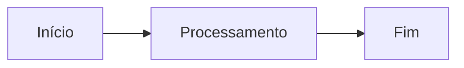

# md2tex

Conversor genérico de documentos **Markdown (`.md`) para LaTeX (`.tex`) e PDF**.

A ferramenta usa o Pandoc para interpretar o Markdown como uma estrutura semântica (AST) e carrega todas as definições de estilo do arquivo de configuração do usuário (`~/.config/md2tex/config.yaml`).

---

## 1. Recursos

- **CLI Instalável**: Comando `md2tex` disponível globalmente ou no ambiente virtual.
- **Configuração do Usuário**: Leitura de pacotes `.sty`, classes de documento e geometrias em `~/.config/md2tex/config.yaml`.
- **Precedência de CLI**: Sobrescrita de configurações via flags CLI (`--config`, `--style`, `--engine`).
- **Saídas Flexíveis**: Geração de código TEX e, opcionalmente, compilação de PDF.
- **Perfis Documentais**: Suporte nativo a relatórios (`report`), memórias de reunião (`meeting-minutes`), ADRs (`adr`) e planos técnicos (`technical-plan`).
- **Estilo Corporativo**: Inclusão automática do pacote `netra-letterhead`.
- **Metadados YAML**: Configuração de capa, título, versão, cliente, data, status e autor via Front Matter ou CLI.
- **Normalização de Títulos**: Remoção automática de numeração manual em títulos Markdown, delegando a numeração ao LaTeX.
- **Formatação Inline Inteligente**:
  - Negrito, itálico, código inline e tachado (inclusive aninhados).
  - Classificação de código: caminhos de arquivos (`\path`), URLs (`\url` com `xurl`), comandos (`\lstinline`) e identificadores (`\texttt`).
- **Controle Avançado de Tabelas**:
  - Envolvimento por ambiente seguro Netra (`\netraStartTable` / `\netraEndTable`).
  - Orientação automática em paisagem (`auto`, `always`, `never`).
  - Ajuste de fonte (`normalsize`, `small`, `footnotesize`, `scriptsize`) e estratégias de largura (`auto`, `equal`, `natural`).
- **Imagens e Mídia**: Limitação à largura e altura úteis da página sem distorção proporcional.
- **Diagramas Mermaid**: Conversão de blocos Mermaid para PNG, PDF ou SVG via `mmdc`.
- **Blocos Especiais**: Caixas destacadas em `tcolorbox` para observações (`note`), avisos (`warning`) e decisões (`decision`).
- **Checklists**: Suporte a listas de tarefas (`- [x]` / `- [ ]`).
- **Validação Robustecida**: Verificação de imagens ausentes, hierarquia de títulos, placeholders `@@PHn@@` e inspeção de logs de compilação.
- **Modo Estrito (CI/CD)**: Interrupção imediata do pipeline em caso de erros ou inconsistências.
- **Limpeza de Auxiliares**: Opções `--clean` e `--clean-all` para manutenção de diretórios de build.
- **Templates Jinja2**: Totalmente customizáveis com delimitadores ajustados para LaTeX.

---

## 2. Arquitetura

```text
Markdown (.md)
   ↓
Leitura do YAML Front Matter
   ↓
Normalização Netra
   ├── Remove numeração manual dos títulos
   ├── Extrai H1 como título (quando necessário)
   └── Processa diagramas Mermaid via mmdc
   ↓
Pandoc + Filtro Lua (netra.lua)
   ├── Converte para AST semântica
   ├── Formata tabelas e define orientação (retrato/paisagem)
   ├── Processa blocos especiais (note, warning, decision)
   └── Classifica código inline (\path, \url, \lstinline, \texttt)
   ↓
Template Jinja2 (*.tex.j2)
   ↓
Validação Pre-compilação / AST
   ↓
Arquivo LaTeX (.tex)
   ↓ (opcional: --pdf)
latexmk / XeLaTeX / LuaLaTeX / PDFLaTeX
   ↓
Leitura do Log & Validação Pós-compilação
   ↓
Documento Final (.pdf)
```

---

## 3. Requisitos do Sistema

### Dependências no Ubuntu/Debian

```bash
sudo apt update
sudo apt install -y python3 python3-venv pandoc texlive-xetex latexmk
```

Para suporte completo a fontes e pacotes LaTeX adicionais:

```bash
sudo apt install -y texlive-latex-extra texlive-fonts-recommended
```

### CLI do Mermaid (Opcional)

Para conversão de diagramas Mermaid em imagens durante a geração do documento:

```bash
sudo npm install -g @mermaid-js/mermaid-cli
```

### Verificação de Ferramentas

```bash
python3 --version
pandoc --version
xelatex --version
latexmk --version
mmdc --version
```

---

## 4. Instalação

### Opção A: Ambiente Virtual (Desenvolvimento / Uso Local)

Na raiz do repositório:

```bash
python3 -m venv .venv
source .venv/bin/activate
pip install --upgrade pip
pip install .
```

Para instalar com dependências de desenvolvimento e testes:

```bash
pip install -e ".[dev]"
```

### Opção B: Instalação via `pipx` (Recomendado no Ubuntu 24.04+ / PEP 668)

O `pipx` permite instalar o pacote em um ambiente isolado disponibilizando o executável `netra-md2tex` globalmente no PATH do usuário.

1. Instale o `pipx`:
   ```bash
   sudo apt update
   sudo apt install -y pipx
   pipx ensurepath
   source ~/.bashrc
   ```

2. Instale o pacote a partir do Wheel gerado:
   ```bash
   pipx install ./dist/netra_md2tex-1.2.1-py3-none-any.whl
   ```

   *(Para atualizar ou sobrescrever uma instalação prévia, utilize `pipx install --force ...`)*

### Testando a Instalação

```bash
netra-md2tex --version
netra-md2tex --help
```

---

## 5. Uso Básico e Exemplo Completo

### Uso Básico

Gerar apenas o arquivo `.tex`:

```bash
netra-md2tex documento.md
```

Gerar o arquivo `.tex` e compilar o PDF:

```bash
netra-md2tex documento.md --pdf
```

### Exemplo Completo (Avançado)

```bash
netra-md2tex documento.md \
  --type report \
  --output build/documento.tex \
  --figures figures \
  --validate \
  --pdf \
  --engine xelatex \
  --landscape-tables auto \
  --table-font small \
  --table-width auto \
  --mermaid-format png \
  --keep-build \
  --force
```

---

## 6. Perfis Documentais

A ferramenta possui 4 perfis pré-configurados que utilizam templates específicos localizados em `src/netra_md2tex/templates/`:

1. **Relatório (`report`)**:
   ```bash
   netra-md2tex relatorio.md --type report
   ```
2. **Memória de Reunião (`meeting-minutes`)**:
   ```bash
   netra-md2tex memoria.md --type meeting-minutes
   ```
3. **Plano de Decisão Arquitetural (`adr`)**:
   ```bash
   netra-md2tex adr.md --type adr
   ```
4. **Plano Técnico (`technical-plan`)**:
   ```bash
   netra-md2tex plano.md --type technical-plan
   ```

---

## 7. Metadados YAML e Precedência

Você pode definir metadados no topo do arquivo Markdown utilizando YAML Front Matter:

```yaml
---
title: Análise de Pertinência de Documentos da SOA
author: Netra Tecnologia
date: 2026-07-30
version: "1.0"
client: Projeto ISO 27001
document-type: Relatório de Análise
subtitle: Declaração de Aplicabilidade
status: Em revisão
---
```

### Precedência de Metadados

Caso um parâmetro seja informado em múltiplos lugares, a ordem de prioridade (da maior para a menor) é:

1. **Argumentos da CLI** (`--title`, `--author`, etc.)
2. **YAML Front Matter** do arquivo Markdown
3. **Primeiro cabeçalho `# H1`** do documento Markdown
4. **Nome do arquivo** (fallback)

Exemplo de sobrescrita de metadados pela CLI:

```bash
netra-md2tex documento.md \
  --title "Título Definitivo" \
  --author "Netra Tecnologia" \
  --date 2026-07-30 \
  --document-version "1.1" \
  --client "Cliente X"
```

---

## 8. Folhas de Estilo Personalizadas e Portabilidade (`--style-path`)

A opção `--style-path` permite especificar **qualquer pacote ou arquivo de estilo LaTeX (`.sty`)**, tanto no padrão corporativo da Netra quanto em estilos genéricos e personalizados.

### Suporte a Estilos Genéricos e Fallbacks

A ferramenta foi projetada com fallbacks universais para garantir que a conversão funcione com qualquer estilo `.sty`:

- **Compatibilidade Global**: O cabeçalho do documento injeta a diretiva `\usepackage{<style_path>}`.
- **Fallbacks Nativos (`\providecommand`)**: Os templates fornecem implementações padrão seguras para comandos internos (como `\netraStartTable`, `\netraEndTable`, `\netraTableOfContents` e `\netraDivider`). Se o seu `.sty` os definir, o seu estilo personalizado terá prioridade; caso contrário, os fallbacks padrão do LaTeX serão usados sem gerar erros.
- **Inclusão Segura de Pacotes (`\@ifpackageloaded`)**: Todos os pacotes essenciais para renderização (tabelas, imagens, caixas anotadas, links, código inline) são carregados condicionalmente, evitando conflitos de pacotes duplicados com a sua folha de estilo.

### Formas de Uso da Flag `--style-path`

1. **Caminho Relativo ou Absoluto**:
   ```bash
   netra-md2tex documento.md --style-path ./estilos/meu-estilo-customizado
   ```
2. **Nome de Pacote Instalado no Sistema TeX**:
   ```bash
   netra-md2tex documento.md --style-path meu-pacote-tex
   ```
3. **Estilo Corporativo Netra (Default)**:
   ```bash
   netra-md2tex documento.md --style-path /home/mlalbuquerque/Dropbox/Netra/projetos/netra-letterhead
   ```

> **Nota de Sintaxe**: O parâmetro deve ser informado **sem a extensão `.sty`** (exemplo: `meu-estilo`), pois o LaTeX adiciona a extensão `.sty` automaticamente na diretiva `\usepackage{...}`. Em ambientes de CI/CD ou distribuição, você também pode especificar caminhos relativos ou utilizar a variável de ambiente `TEXINPUTS`.

---

## 9. Sintaxe Markdown e Conversão LaTeX

### Títulos e Numeração Manual

Numerações manuais em títulos do Markdown são removidas durante a normalização, permitindo que o LaTeX gerencie a numeração oficial.

- **Markdown**: `## 1. Introdução`
- **LaTeX gerado**: `\section{Introdução}`

*(Conteúdo dentro de blocos de código fenced não é alterado).*

### Formatação Inline e Código

O conversor classifica inteligentemente trechos de código inline:
- **Caminhos de arquivo** (Linux/Windows): convertidos com `\path{...}`, permitindo quebra em `/`, `\`, `-`, `_`.
- **URLs**: convertidas com `\url{...}` (pacote `xurl`).
- **Comandos com argumentos/espaços**: convertidos com `\lstinline{...}`.
- **Termos curtos/código comum**: convertidos com `\texttt{...}`.
- **Formatação aninhada**: **negrito**, *itálico* e ~~tachado~~ funcionam de forma fluida sem resíduos de parsing.

### Tabelas

Tabelas em Markdown são envoltas pelos comandos `\netraStartTable` e `\netraEndTable`.

```md
| Controle | Status | Evidência |
|---|---|---|
| A.5.8 | Aplicável | Documento de Visão |
| A.8.11 | Parcial | Script de mascaramento |
```

Configurações CLI para Tabelas:
- **Orientação (`--landscape-tables`)**:
  - `auto` *(padrão)*: Aplica orientação paisagem automaticamente para tabelas com 6 ou mais colunas.
  - `always`: Força todas as tabelas em paisagem.
  - `never`: Mantém todas as tabelas em modo retrato.
- **Tamanho da Fonte (`--table-font`)**: `normalsize`, `small` *(padrão)*, `footnotesize`, `scriptsize`.
- **Largura das Colunas (`--table-width`)**:
  - `auto` *(padrão)*: Proporcional ao conteúdo.
  - `equal`: Larguras idênticas para todas as colunas.
  - `natural`: Utiliza as larguras calculadas pelo Pandoc/LaTeX.

### Blocos Especiais (Admonitions)

Blocos anotados são renderizados como caixas de destaque `tcolorbox`:

```md
::: note
Observação importante referente ao escopo.
:::

::: warning
Alerta sobre restrições de permissão e acesso.
:::

::: decision
Decisão tomada pela equipe de arquitetura.
:::
```

### Checklists

Listas de checagem utilizam a extensão `task_lists` do Pandoc:

```md
- [x] Requisito atendido
- [ ] Pendente de validação
```

### Imagens e Ajuste Proporcional

```md
{width=90% height=75%}
```

- As dimensões `width` e `height` definem limites máximos (`95%` de `\linewidth` e `78%` de `\textheight` por padrão).
- A proporção da imagem é **sempre preservada** (sem esticar ou achatar).
- As imagens são centralizadas automaticamente com legenda derivada do texto alternativo.

### Diagramas Mermaid

````md

````

Flags de formato Mermaid: `--mermaid-format png` *(padrão)*, `pdf` ou `svg`. Para desativar a geração de diagramas, utilize `--no-mermaid`.

---

## 10. Geração de PDF e Limpeza

### Motores de Compilação

Para compilar o PDF utilize a flag `--pdf`:

```bash
netra-md2tex documento.md --pdf --engine xelatex
```

Motores suportados: `xelatex` *(padrão)*, `lualatex`, `pdflatex`. A compilação utiliza `latexmk` se disponível, executando passagens adicionais automaticamente quando necessário.

### Limpeza de Arquivos Auxiliares

- `--clean`: Remove arquivos intermediários de compilação (`.aux`, `.log`, `.out`, `.synctex.gz`, `.fls`, `.fdb_latexmk`, `.xdv`), preservando o `.toc`.
- `--clean-all`: Remove todos os arquivos temporários, incluindo o sumário `.toc`. Os arquivos `.tex` e `.pdf` finais nunca são apagados.

### Diagnóstico de Build (`--keep-build`)

Utilize `--keep-build` para preservar a pasta temporária `.documento-build/`, contendo o Markdown pré-processado (`preprocessed.md`) e o fragmento LaTeX (`fragment.tex`).

---

## 11. Validação e Modo Estrito

A validação é ativada por padrão (`--validate`):
- Verifica preenchimento de título e metadados obrigatórios.
- Garante a consistência da hierarquia de cabeçalhos.
- Detecta imagens locais inexistentes.
- Garante ausência de placeholders não convertidos (`@@PHn@@`).
- Inspeciona o log do LaTeX (`.log`) e extrai a mensagem de erro exata iniciada por `!` (ex: `! Undefined control sequence`, `! LaTeX Error: ...`), exibindo o diagnóstico exato no terminal em caso de falhas de compilação.
- Identifica referências e citações não resolvidas, além de avisos de `Overfull \hbox`.

### Modo Estrito para Pipelines (CI/CD)

```bash
netra-md2tex documento.md --strict
```

No modo estrito (`--strict`), qualquer inconsistência ou aviso de validação faz o comando encerrar com código de erro não-zero, interrompendo a execução de pipelines de automação.

---

## 12. Templates Jinja2 Personalizados

É possível fornecer um template Jinja2 customizado com `--template meu_template.tex.j2`.

Os templates usam delimitadores adaptados para compatibilidade com LaTeX:
- **Variáveis**: `((* metadata.title *))`
- **Blocos**: `((% if toc %))` ... `((% endif %))`
- **Filtros**: `((* metadata.title | latex *))`

Variáveis expostas no contexto: `metadata`, `body`, `style_path`, `toc`, `engine`, `used_svg`.

---

## 13. Referência de Opções do CLI

```text
Usage: netra-md2tex [OPTIONS] INPUT_FILE

Options:
  -o, --output FILE                  Caminho do arquivo TEX de saída.
  --type [report|meeting-minutes|adr|technical-plan]
                                     Perfil documental a ser utilizado.
  --title TEXT                       Título do documento.
  --author TEXT                      Autor do documento.
  --date TEXT                        Data do documento.
  --document-version TEXT            Versão do documento.
  --client TEXT                      Nome do cliente.
  --style-path TEXT                  Caminho para o estilo netra-letterhead.
  --figures DIRECTORY                Diretório de saída para imagens e diagramas.
  --template FILE                    Template Jinja2 customizado (.tex.j2).
  --pdf / --no-pdf                   Habilita ou desabilita a compilação PDF.
  --validate / --no-validate         Habilita ou desabilita as validações.
  --strict                           Modo estrito (falha em qualquer aviso/erro).
  --toc / --no-toc                   Inclui ou omite o sumário.
  --engine [xelatex|lualatex|pdflatex]
                                     Motor de compilação LaTeX.
  --mermaid / --no-mermaid           Habilita ou desabilita o processamento Mermaid.
  --mermaid-format [png|pdf|svg]     Formato das imagens de diagramas Mermaid.
  --landscape-tables [auto|always|never]
                                     Orientação automática de tabelas.
  --table-font [normalsize|small|footnotesize|scriptsize]
                                     Tamanho da fonte das tabelas.
  --table-width [auto|equal|natural] Estratégia de largura das colunas.
  --shell-escape                     Habilita --shell-escape na compilação.
  --keep-build                       Mantém os arquivos intermediários de build.
  --clean                            Apaga arquivos auxiliares após compilação.
  --clean-all                        Apaga arquivos auxiliares e o sumário TOC.
  --force                            Sobrescreve arquivos existentes sem confirmação.
  -v, --verbose                      Exibe mensagens detalhadas no terminal.
  --version                          Exibe a versão instalada.
  -h, --help                         Exibe esta mensagem de ajuda.
```

---

## 14. Estrutura do Projeto

```text
netra-md2tex/
├── bin/
│   └── netra-md2tex               # Script executável direto
├── examples/                      # Exemplo de documentos em Markdown
│   ├── adr.md
│   └── relatorio.md
├── src/netra_md2tex/             # Código-fonte principal
│   ├── filters/
│   │   └── netra.lua              # Filtro Lua do Pandoc
│   ├── templates/                 # Templates Jinja2 LaTeX
│   │   ├── adr.tex.j2
│   │   ├── base.tex.j2
│   │   ├── meeting-minutes.tex.j2
│   │   ├── report.tex.j2
│   │   └── technical-plan.tex.j2
│   ├── cli.py
│   ├── compiler.py
│   ├── converter.py
│   ├── errors.py
│   ├── frontmatter.py
│   ├── mermaid.py
│   ├── metadata.py
│   ├── models.py
│   ├── pandoc.py
│   ├── profiles.py
│   ├── templates.py
│   ├── utils.py
│   └── validator.py
├── tests/                         # Testes automatizados (pytest)
├── LICENSE                        # Licença MIT
├── pyproject.toml                 # Definição do projeto e empacotamento Python
└── README.md                      # Documentação oficial
```

---

## 15. Desenvolvimento, Testes e Licença

### Execução dos Testes Automatizados

Para rodar a suíte completa de testes:

```bash
pytest
```

Para verificar a cobertura de testes:

```bash
pytest --cov=netra_md2tex --cov-report=term-missing
```

### Licença

Distribuído sob a licença **MIT**. Veja `LICENSE` para mais informações.
